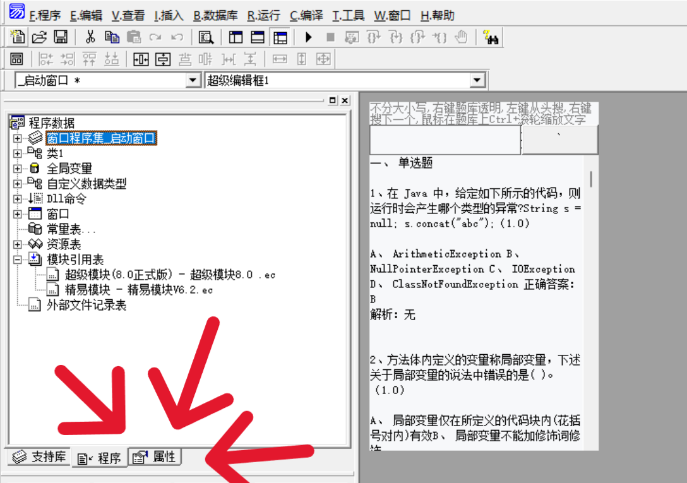
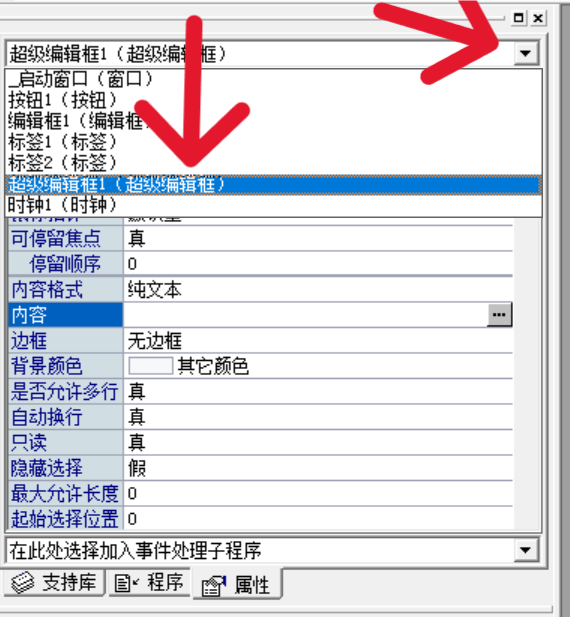
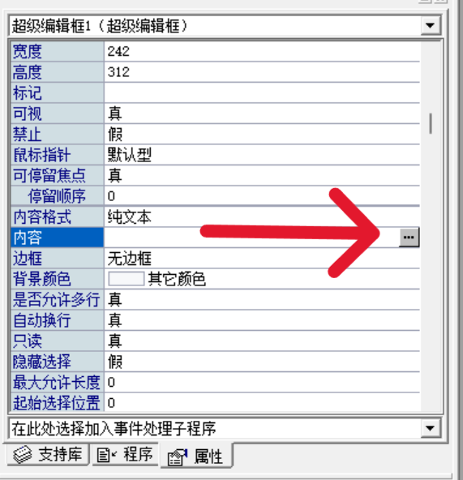
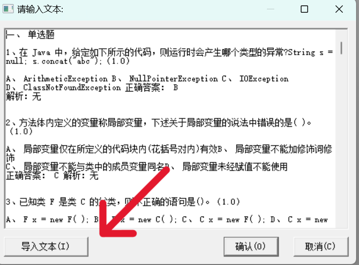
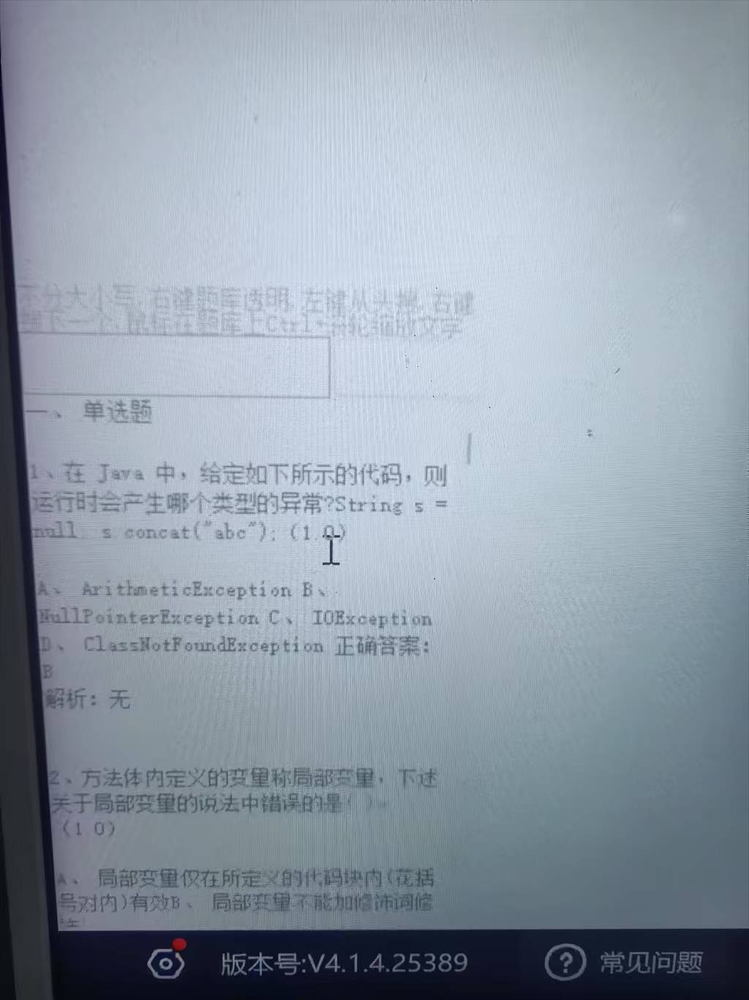

此脚本用于超星学习通考试端考试搜题
====================
仅支持在有题库的情况下使用此脚本 
此脚本为易语言编写，修改搜索框内容需要有易语言编辑器 
第一次使用时需要将两个模块的地址改为自己的地址 
---------------------
搜索框内容修改方法 
使用易语言编辑器打开脚本文件 
1.点击属性按钮 
 
2.在属性下拉框选择超级编辑框1 
 
3.找到内容一栏，点击后面三个点 
 
4.点击导入文本 
文本必须为ANSI编码格式的txt文件 
 
使用方法 
在静态编译后打开exe文件 
运行后无任何显示为正常现象，此时打开学习通考试端 
鼠标移至左下角则会显示搜索框 
 

1.右键单击搜索框  搜索框隐身/显现 
2.在上方搜索框搜索文字 左键单击后面按钮 下方搜索框会定位到搜索的文字（搜索的文字要以导入的格式为标准，不会舍去空格等符号，英文无需区分大小写） 
3.右键单击上方搜索框按钮  搜索框会自动并定位到下一个 
4.在退出考试后 点击搜索框 按ESC退出程序

## :warning: 免责声明
- 本代码遵循 [GPL-3.0 License](https://github.com/SJYssr/Cx_EXAM/blob/main/LICENSE) 协议，允许**开源/免费使用和引用/修改/衍生代码的开源/免费使用**，不允许**修改和衍生的代码作为闭源的商业软件发布和销售**，禁止**使用本代码盈利**，以此代码为基础的程序**必须**同样遵守 [GPL-3.0 License](https://github.com/SJYssr/Cx_EXAM/main/LICENSE) 协议
- 本代码仅用于**学习讨论**，禁止**用于盈利**
- 他人或组织使用本代码进行的任何**违法行为**与本人无关